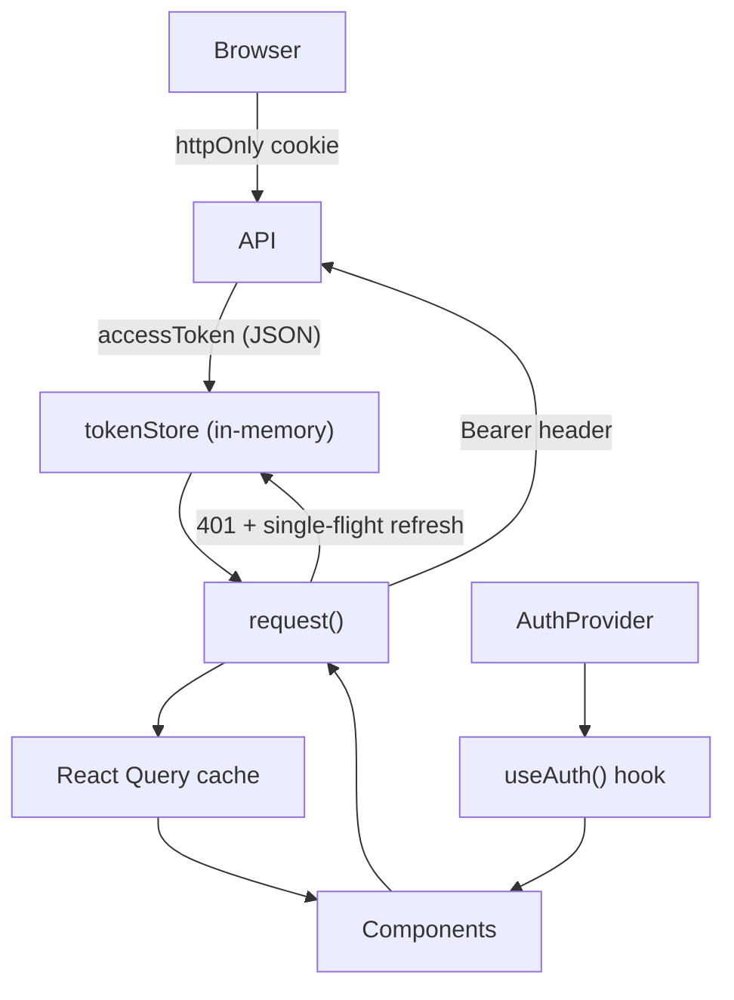

# Web Architecture Overview

> **Summary:** Next.js App Router structure, provider stack, auth session lifecycle, and auth gate HOCs.
> **Read this when:** You need the big picture before making any non-trivial frontend change, or you want to understand how routing, state, and auth fit together.
> **Audience:** both
> **Related:** [Components](components.md) · [API client reference](../reference/api-client.md)

[← Back to web docs index](../INDEX.md)

---

## Route tree

```
/                           → redirect to /login
├── /login                  app/login/page.tsx          (public, redirects ACTIVE → /dashboard)
│                             ?testAccountExpired=1 → info alert (test account expired/deleted)
├── /register               app/register/page.tsx        (public, redirects ACTIVE → /dashboard)
├── /activate               app/activate/page.tsx        (public — PENDING users land here)
│
└── app/study/layout.tsx    → <AppShell> (RequireAuth + TestAccountBanner + AppNav)
    ├── /dashboard          app/dashboard/page.tsx
    ├── /account            app/account/page.tsx
    └── /study/[level]/[block]/page.tsx
```

The root `app/layout.tsx` mounts `<Providers>` once for the whole app. The `app/study/layout.tsx` wraps all protected pages with `<AppShell>`.

Auth pages (`/login`, `/register`, `/activate`) wrap their content with `<RedirectIfAuthed>`, which bounces ACTIVE sessions to `/dashboard` before the form renders. `/login` and `/register` also render `<TestAccountButton>` ("Try a test account") below the form — see [components](components.md#test-account-banner).

The `/account` page uses its own inline `<RequireAuth>` (it is not under the `study/` layout).

---

## Provider stack

Rendered once from `src/app/providers.tsx`, mounted inside `RootLayout`:

```
<ThemeRegistry>                ← MUI theme + Emotion SSR cache (AppRouterCacheProvider)
  <QueryClientProvider>        ← TanStack React Query (one QueryClient per browser session)
    <AuthProvider>             ← in-memory auth state + session bootstrap
      {children}
    </AuthProvider>
  </QueryClientProvider>
</ThemeRegistry>
```

**React Query defaults** (`src/app/providers.tsx`):

| Option | Value | Reason |
|--------|-------|--------|
| `staleTime` | 30 000 ms | Avoids re-fetching on every tab-focus |
| `retry` | 1 | One retry on transient errors |
| `refetchOnWindowFocus` | false | Avoids noisy refetches while studying |

---

## Auth session lifecycle {#auth-flow}

The web app uses a **dual-token** pattern:

| Token | Storage | Lifetime | Purpose |
|-------|---------|----------|---------|
| Access token (JWT) | In-memory (`tokenStore`) | 15 min | Bearer for every API call |
| Refresh token | httpOnly cookie | 7 days | Renew the access token transparently |

The access token is **never** persisted across page reloads. On reload, `AuthProvider` runs a silent refresh to restore the session.

### Bootstrap (page load / reload)

```
AuthProvider mounts
  └─ POST /auth/refresh  (sends httpOnly cookie, no Bearer)
       ├─ 200 → tokenStore.set(accessToken)
       │         GET /auth/me → setUser(me) → setAccessToken(token)
       │         isBootstrapping = false
       └─ failure → clearAuth() → isBootstrapping = false (stays logged out)
```

Components that read `isBootstrapping` must show a loader until it resolves. `RequireAuth` and `RedirectIfAuthed` both do this, so protected and auth pages never flash the wrong UI.

### Login

```
useAuth().login(email, password)
  └─ POST /auth/login → AuthTokens + refresh cookie
       └─ tokenStore.set(accessToken)
            GET /auth/me → setAuth(user, token) → resolves with User
```

### Test account

```
useAuth().startTestAccount()
  └─ POST /auth/test-account → TestAccountTokens (AuthTokens + testAccountExpiresAt) + refresh cookie
       └─ tokenStore.set(accessToken)
            GET /auth/me → setAuth(user, token)   (user.isTestAccount = true)
```

Triggered by `<TestAccountButton>` on `/login` and `/register`. A `429 TEST_ACCOUNT_RATE_LIMITED` (one test account per IP per hour) is shown inline instead of throwing. Once logged in, `<TestAccountBanner>` (mounted in `<AppShell>`) shows a countdown to `user.testAccountExpiresAt` and, on expiry, logs out and redirects to `/login?testAccountExpired=1`.

### Logout

```
useAuth().logout()
  └─ POST /auth/logout  (best-effort — clears the server-side cookie)
       └─ clearAuth()   (always runs, even if the request fails)
```

### Automatic token refresh (401 recovery)

`request<T>()` in `src/lib/api-client.ts` intercepts any `401` response and performs a **single-flight** refresh before retrying:

```
fetch(path) → 401
  └─ refreshAccessToken()       single-flight: only one refresh for concurrent 401s
       ├─ 200 → retry original request with new token
       └─ failure → onAuthFailure() → clearAuth() → original 401 propagates as ApiError
```

The retry flag (`_retried: true`) prevents infinite loops on a second 401.

---

## Auth gate HOCs {#auth-gates}

Both live in `src/components/RequireAuth.tsx`.

### `<RequireAuth>`

Use on every protected page or layout. Redirect rules:

| State | Action |
|-------|--------|
| Bootstrapping | Render `<FullScreenLoader>` |
| No user | Redirect to `/login` |
| User is `PENDING` | Redirect to `/activate` |
| User is `ACTIVE` | Render children |

### `<RedirectIfAuthed to="/dashboard">`

Use on public auth pages (login / register / activate). Redirect rules:

| State | Action |
|-------|--------|
| Bootstrapping | Render `<FullScreenLoader>` |
| User is `ACTIVE` | Redirect to `to` (default `/dashboard`) |
| Otherwise | Render children |

PENDING users are allowed through so they can complete activation.

---

## Data flow diagram



---

*Next: [Components](components.md) for the full component map, or [API client reference](../reference/api-client.md) for `request<T>()` and `useAuth()` details.*
