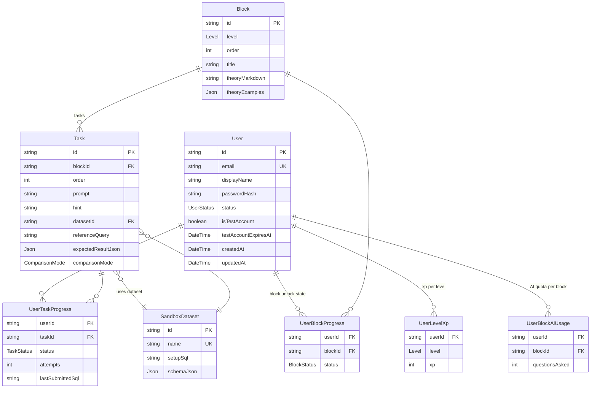

# Data Model

> **Summary:** All Prisma entities, their relationships, key enums, and the progression rules that govern block/task state.
> **Read this when:** You're changing the database schema, adding new curriculum entities, or debugging progression logic.
> **Audience:** both
> **Related:** [Architecture overview](overview.md) · [Modules](modules.md#study) · [Configuration](../reference/configuration.md)

[← Back to docs index](../INDEX.md)

---

## TL;DR

Two domains share the schema: **curriculum** (`Block`, `Task`, `SandboxDataset`) defined by seed data, and **progress** (`UserBlockProgress`, `UserTaskProgress`, `UserLevelXp`, `UserBlockAiUsage`) written at runtime. The canonical schema is `apps/api/prisma/schema.prisma`. Enums are mirrored in `packages/contracts/src/` — keep both in sync.

## Entity diagram

## Entities

### User

Represents a registered student account.

| Field | Type | Notes |
|-------|------|-------|
| `id` | `String` (cuid) | Primary key |
| `email` | `String` | Unique; used for login and activation |
| `displayName` | `String` | Shown in the UI; can be changed in account settings |
| `passwordHash` | `String` | Argon2 hash — never returned to clients |
| `status` | `UserStatus` | `PENDING` until email activated; `ACTIVE` thereafter |
| `isTestAccount` | `Boolean` | `true` for throwaway "try it out" accounts created via `POST /auth/test-account`; default `false` |
| `testAccountExpiresAt` | `DateTime?` | Set only for test accounts; `TestAccountCleanupService` deletes the row once this passes |

### Block

A curriculum unit. Belongs to exactly one `Level`, ordered within it.

| Field | Type | Notes |
|-------|------|-------|
| `level` | `Level` | `NOVICE` / `JUNIOR` / `MIDDLE` |
| `order` | `Int` | 1-based position within the level |
| `title` | `String` | Display name |
| `theoryMarkdown` | `String` | Background theory shown before tasks |
| `theoryExamples` | `Json` | Worked examples (array of `{ sql, description }`) |

### Task

An individual SQL problem inside a block.

| Field | Type | Notes |
|-------|------|-------|
| `order` | `Int` | 1-based position within the block |
| `prompt` | `String` | Problem statement shown to the student |
| `hint` | `String` | Optional hint shown on request |
| `datasetId` | `String` | References a `SandboxDataset` |
| `referenceQuery` | `String` | Correct SQL — **never sent to clients or AI context** |
| `expectedResultJson` | `Json` | Baked correct result rows (generated by seed validator) |
| `comparisonMode` | `ComparisonMode` | `ORDERED` (row order matters) or `UNORDERED` |

### SandboxDataset

A reusable dataset definition. Multiple tasks can share one dataset.

| Field | Type | Notes |
|-------|------|-------|
| `name` | `String` | Unique slug (e.g. `employees_v1`) |
| `setupSql` | `String` | `CREATE TABLE` + `INSERT` statements run before each query |
| `schemaJson` | `Json` | Parsed table/column metadata shown in the UI (not the raw SQL) |

### Progress tables

| Table | Tracks | Key fields |
|-------|--------|------------|
| `UserLevelXp` | XP earned per level | `(userId, level)` composite unique; `xp` int |
| `UserBlockProgress` | Block unlock/completion state | `(userId, blockId)` unique; `status: BlockStatus` |
| `UserTaskProgress` | Task attempt history | `(userId, taskId)` unique; `status`, `attempts`, `lastSubmittedSql` |
| `UserBlockAiUsage` | AI questions asked per block | `(userId, blockId)` unique; `questionsAsked` (max 10) |

## Enums

Canonical definitions live in two places — **keep them in sync**:
- `apps/api/prisma/schema.prisma` (drives the DB)
- `packages/contracts/src/` (drives TypeScript types and API validation)

| Enum | Values | Defined in contracts |
|------|--------|----------------------|
| `Level` | `NOVICE` `JUNIOR` `MIDDLE` | `study.ts` |
| `UserStatus` | `PENDING` `ACTIVE` | `auth.ts` |
| `TaskStatus` | `NOT_STARTED` `COMPLETED` `SKIPPED` | `study.ts` |
| `BlockStatus` | `LOCKED` `IN_PROGRESS` `COMPLETED` | `study.ts` |
| `ComparisonMode` | `ORDERED` `UNORDERED` | `common.ts` |

## Progression rules

These are implemented as pure functions in `apps/api/src/study/progression.ts`.

**Block unlock:**
- Block 1 of any level is always unlocked (status: `IN_PROGRESS`).
- Block N requires block N−1 to be `COMPLETED`.

**Task completion:**
- A task becomes `COMPLETED` when the student's SQL produces a result matching `expectedResultJson` (per `comparisonMode`).
- A task becomes `SKIPPED` when the student reveals the reference answer.

**Block completion:**
- A block is `COMPLETED` when every task is `COMPLETED` or `SKIPPED` — zero `NOT_STARTED` tasks.

**XP award:**
- XP is granted on the **first** block completion only (not on re-completion).
- Amounts: `NOVICE` blocks → 100 XP · `JUNIOR` → 150 XP · `MIDDLE` → 200 XP.
- Stored in `UserLevelXp`, incremented per level.

**AI quota:**
- Capped at 10 questions per (user, block) pair.
- Tracked in `UserBlockAiUsage.questionsAsked` (incremented on each ask).

## Seed system

Curriculum is loaded via an idempotent seed (`pnpm db:seed`). The process is:

1. **Define content** — `apps/api/prisma/seed/{level}/block{N}.ts` (block metadata, tasks, datasets)
2. **Validate** — `pnpm --filter api db:validate` runs each `referenceQuery` against its dataset and bakes results into `{level}/baked.json`
3. **Seed** — `pnpm db:seed` reads the baked JSON and upserts `SandboxDataset`, `Block`, `Task` records (keyed by unique constraints)

See [Development — Adding content](../guides/development.md#adding-content) for the step-by-step workflow.

---

*Related: [Architecture overview](overview.md) · [Modules — Study](modules.md#study) · back to the [index](../INDEX.md).*
