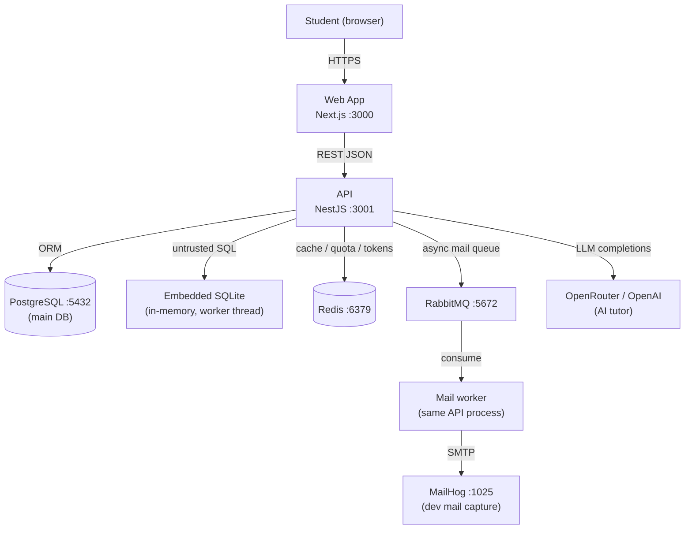
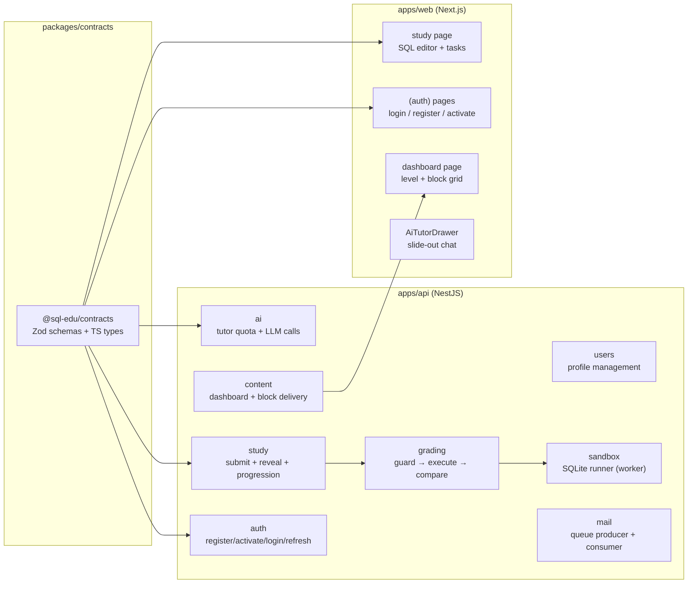

# Architecture Overview

> **Summary:** How the system is structured, the main components, and how data flows through it.
> **Read this when:** You need the big picture before changing anything non-trivial.
> **Audience:** both
> **Related:** [Modules](modules.md) · [Data model](data-model.md) · [ADRs](decisions/)

[← Back to docs index](../INDEX.md)

---

## TL;DR

SQL Education is a layered monorepo: a **NestJS REST API** (port 3001) handles all business logic, a **Next.js web app** (port 3000) provides the UI, and a **shared contracts package** (`@sql-edu/contracts`) carries Zod schemas and TypeScript types that both sides agree on. Users progress through curriculum levels (NOVICE → JUNIOR → MIDDLE), solving SQL tasks graded by running their query in an **embedded in-process SQLite sandbox** (a fresh in-memory database per request, in a worker thread). An **AI tutor** answers questions per block (capped at 10, quota in Redis) without ever revealing reference answers.

## System context

## Components

| Component | Responsibility | Location |
|-----------|----------------|----------|
| `@sql-edu/contracts` | Single source of truth for all API types (Zod + TypeScript) | `packages/contracts/src/` |
| `AuthModule` | Register, email activation, login, JWT refresh/logout | `apps/api/src/auth/` |
| `UsersModule` | Read/update profile (`/users/me`) | `apps/api/src/users/` |
| `ContentModule` | Dashboard data, full block content — read-only | `apps/api/src/content/` |
| `StudyModule` | Submit SQL answers, reveal reference answers, progression write path | `apps/api/src/study/` |
| `GradingModule` | 3-stage pipeline: forbidden-statement guard → sandbox exec → result compare | `apps/api/src/grading/` |
| `SandboxModule` | Runs untrusted SQL in embedded SQLite (fresh in-memory DB per request, in a worker thread with a hard timeout) | `apps/api/src/sandbox/` |
| `AiModule` | Per-block quota, prompt building, LLM call, response sanitization | `apps/api/src/ai/` |
| `MailModule` | RabbitMQ producer (API) + consumer (worker) for transactional email | `apps/api/src/mail/` |
| Web — Dashboard | Level selector + block grid with unlock state and XP display | `apps/web/src/app/dashboard/` |
| Web — Study | SQL editor (CodeMirror), task prompt, dataset schema, result table | `apps/web/src/app/study/[level]/[block]/` |

## Data flow — submitting a SQL answer

This is the hottest path; all other writes are simpler.

1. Student types SQL and clicks Submit — `apps/web/src/components/study/TaskCard.tsx`
2. `POST /study/tasks/:taskId/submit { sql }` — `StudyController.submit`
3. DTO validated via `nestjs-zod` ZodValidationPipe — `@sql-edu/contracts` `SubmitAnswerSchema`
4. `StudyService` loads the task (with dataset + block) and checks block unlock state via `ContentService`
5. `GradingService.grade` runs the 3-stage pipeline:
   - **Guard:** `checkForbiddenStatement` — rejects `DELETE/UPDATE/CREATE/DROP`
   - **Execute:** `SqliteSandboxRunner.runGraded` — runs `setupSql` + the student query in a fresh in-memory SQLite DB inside a worker thread; 2-second timeout enforced by terminating the worker
   - **Compare:** `compareResults` — `ORDERED` (exact row order) or `UNORDERED` (any order)
6. `StudyService` persists `UserTaskProgress` (status, attempts, last submitted SQL)
7. Checks if all block tasks are `COMPLETED` or `SKIPPED` → marks block complete, awards XP (first time only)
8. Returns `SubmitResult { correct, status, message, columns, rows, errorType }`

## Security model

| Concern | Approach |
|---------|----------|
| Authentication | JWT access tokens (15 min, `Authorization: Bearer`) + refresh tokens (7 days, httpOnly cookie) |
| Authorization | `JwtAuthGuard` + `ActiveUserGuard` (must be `UserStatus.ACTIVE`) |
| Email activation | 6-char code in Redis, 15-min TTL, limited attempts |
| Passwords | Argon2 hashing |
| SQL execution | Embedded SQLite — a fresh in-memory DB per request holding only the task fixture (no app data to leak), run in a worker thread terminated at a 2s timeout; the forbidden-statement guard still restricts input to a single read-only `SELECT`/`WITH` |
| AI safety | `SAFE_BLOCK_SELECT` in `AiService` deliberately omits `referenceQuery` from LLM context |
| Rate limiting | Throttler module (100 req / 60 s default); tighter per route where needed |

## Cross-cutting concerns

- **Configuration:** `@nestjs/config` with Zod validation at startup — see [Configuration](../reference/configuration.md)
- **Error handling:** NestJS exceptions (`HttpException` subclasses); `ZodValidationPipe` for DTO errors; `SandboxRunner` wraps SQL errors into safe typed `errorType` values
- **Observability:** `/health` endpoint (`HealthModule`) for container orchestration; Swagger UI at `/docs`
- **Email:** Async RabbitMQ queue (producer in `MailService`, consumer in `MailConsumer`); dev mail captured by MailHog

## Key decisions

- [ADR-0001](decisions/0001-monorepo-shared-contracts.md) — Turborepo monorepo with a shared `@sql-edu/contracts` package
- [ADR-0002](decisions/0002-isolated-sql-sandbox.md) — Isolated PostgreSQL instance for untrusted SQL execution *(superseded)*
- [ADR-0003](decisions/0003-sqlite-in-process-sandbox.md) — In-process SQLite for untrusted SQL execution

---

*Next: [Modules](modules.md) for area-by-area detail, or [Data model](data-model.md) for entity relationships.*
